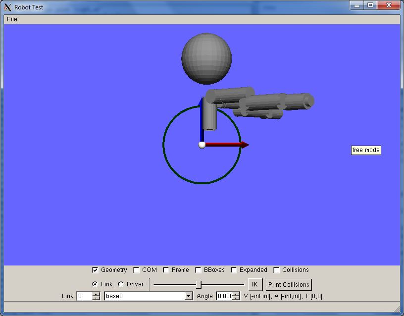
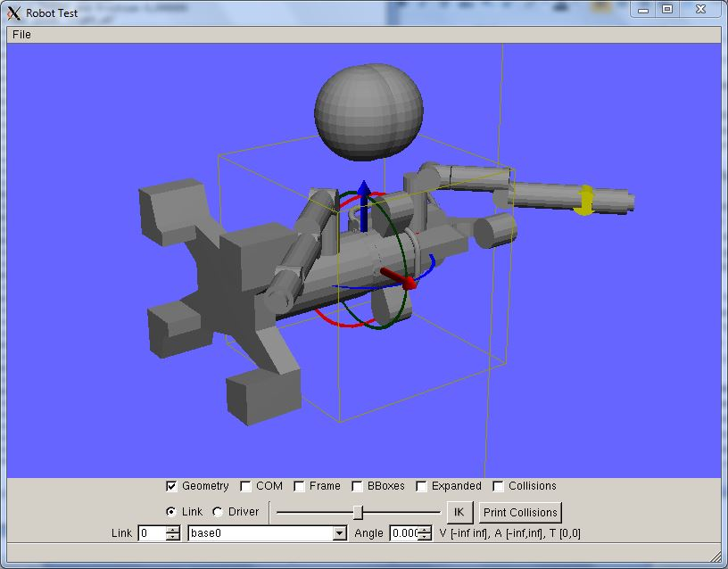
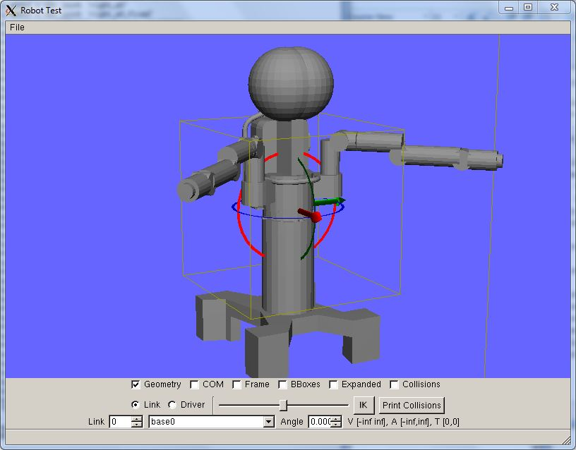
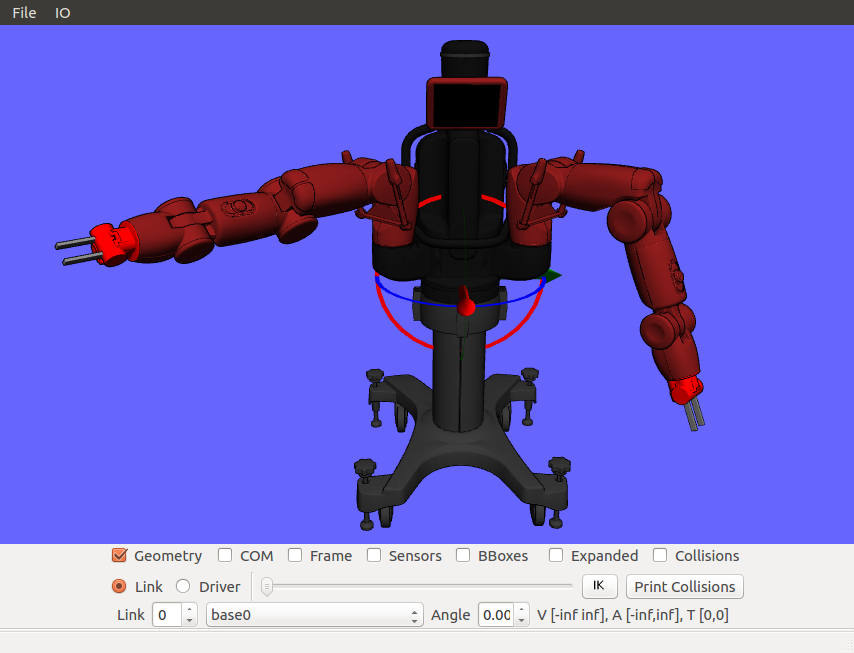
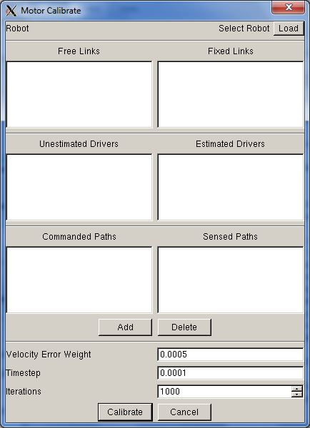
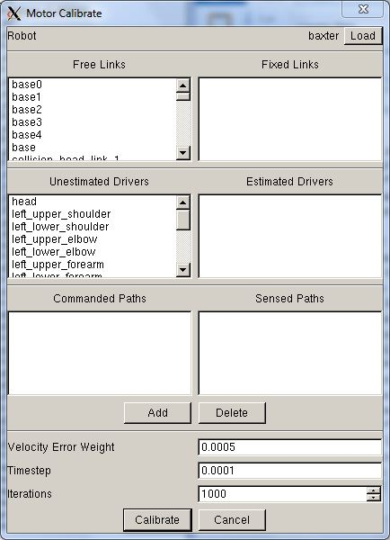
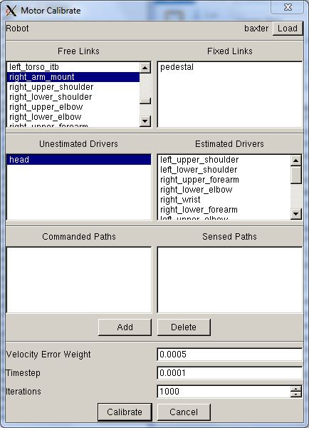
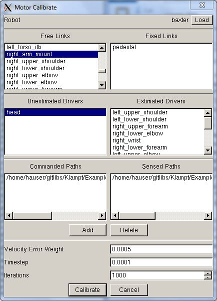

# Klamp't Tutorial: Import and calibrate a URDF robot

URDF is a common XML-based format for robots, popularized by its use in ROS. Klamp't natively uses a text-based .rob file but is also able to import URDF files fairly easily. However, Klamp't robots do contain some elements that are not present in URDF, in particular to mark which links can self collide, and to simulate motor behavior.

This tutorial will discuss how to add Klamp't-specific elements to URDF files so they can be loaded natively, as well as how to calibrate the motor parameters used in Klamp't using real data.

Difficulty: easy

Time: 5-15 minutes

## Adding Klampt's elements to URDF
Through this tutorial we will be using the Rethink Robotics Baxter robot as an example. Although Klamp't has a Baxter model built in as a .rob file, we'll show how to use the URDF from scratch.

### Basics: package paths and geometry

First, download the  [baxter_common](https://github.com/RethinkRobotics/baxter_common)  package provided by Rethink Robotics (date of testing: 7/1/2014). The URDF file is located in baxter_common/baxter_description/urdf/baxter.urdf. We'll assume the package is in the same parent directory as Klamp't

We can try loading this file using:
```
bin/RobotTest ../baxter_common/baxter_description/urdf/baxter.urdf
```



First, let's look at the output of the importer on the command line. You should see some lines similar to

```
Could not load geometry /baxter_description/meshes/torso/base_link_collision.DAE,  
in relative or absolute paths
```
This is because the URDF is referring to files in ROS packages in the "package://" directive, and Klamp't has no idea about ROS. What we can do is tell Klamp't where these files lie. We'll add the following line to the second-to-last line of the URDF file, right before < /robot >:
```
  <klampt package_root="../.." />
```
Running RobotTest again, we get the following result:



Yuck! Something strange happened to the robot's meshes. This is relatively common due to a flipping in the Y-Z coordinates, since some modeling packages consider Y to be up, while others consider Z to be up. We can fix this by enabling the flip_yz XML attribute to the klampt tag:
```
  <klampt package_root="../.." flip_yz="1"/>
```



Much better! However, rather than seeing the real geometry of the robot, we just see some floating cylinders and spheres. This is because Klamp't is only loading the  _collision geometry_of the URDF file. Klamp't does not distinguish between collision and visualization geometry, so you will have to pick which type of geometry you wish to use. To switch to visualization geometry, we'll enable the use_vis_geom attribute in the klampt XML tag
```
  <klampt package_root="../.." flip_yz="1" use_vis_geom="1"  />
```


Very nice!

### Simulation and Non-Physical Links
Now if we were to simulate this robot in SimTest, we'd find that the robot goes unstable almost instantly. Try:
```
bin/SimTest ../baxter_common/baxter_description/urdf/baxter.urdf
```
and watch it blow up!
This problem occurs primarily because the URDF file contains many non-physical links with very small mass, which are unstable when connecting larger links (in particular, the X_arm_mount links are the culprit here). You should set these to non-physical links (or set their masses to 0) so that they are not simulated.
```
<klampt package_root="../.." flip_yz="1" use_vis_geom="1"  >			
	<link name="dummyhead1" physical="0" />
    <link name="head_camera" physical="0" />
    <link name="display" physical="0" />
    <link name="left_arm_mount" physical="0" />
    <link name="left_arm_itb" physical="0" />
    <link name="left_upper_elbow_visual" physical="0" />
    <link name="left_upper_forearm_visual" physical="0" />
    <link name="left_gripper_base" physical="0" />
    <link name="left_gripper" physical="0" />
    <link name="left_hand_camera" physical="0" />
    <link name="left_hand_camera_axis" physical="0" />
    <link name="left_hand_range" physical="0" />
    <link name="right_arm_mount" physical="0" />
    <link name="right_arm_itb" physical="0" />
    <link name="right_upper_elbow_visual" physical="0" />
    <link name="right_upper_forearm_visual" physical="0" />
    <link name="right_gripper_base" physical="0" />
    <link name="right_gripper" physical="0" />
    <link name="right_hand_camera" physical="0" />
    <link name="right_hand_camera_axis" physical="0" />
    <link name="right_hand_range" physical="0" />
    <link name="sonar_ring" physical="0" />
    <link name="collision_head_link_1" physical="0" />
    <link name="collision_head_link_2" physical="0" />
    <link name="left_upper_shoulder" servoP="200" servoI="0" servoD="10"/>
    <link name="left_lower_shoulder" servoP="600" servoI="0" servoD="10"/>
    <link name="left_lower_forearm" servoP="20" servoI="0" servoD="1"/>
    <link name="right_upper_shoulder" servoP="200" servoI="0" servoD="10"/>
    <link name="right_lower_shoulder" servoP="600" servoI="0" servoD="10"/>
    <link name="right_lower_forearm" servoP="20" servoI="0" servoD="1"/>
  </klampt>
```
Once this issue is fixed, you can see that the robot simply falls. You can either place a plane below the robot in SimTest, or mark that the robot has a fixed base using the fixed_root_link attribute:
```
  <klampt package_root="../.." flip_yz="1" use_vis_geom="1"  fixed_root_link="1" >
```
Another issue is that smooth point-to-point motions require the definition of acceleration limits for each link. These default to 100, which is rather fast. You can set a uniform acceleration limit using the default_acc_max attribute:
```
  <klampt package_root="../.." flip_yz="1" use_vis_geom="1"  fixed_root_link="1" default_acc_max="4" >
```
Or specify an individual value per-link:
```
    <link name="left_upper_shoulder" accMax="3" >
```
### Eliminating self-collision detection

If you are not planning on using self-collision detection in Klamp't, you can skip ahead to the next section. Otherwise, keep following along...

For collision detection and motion planning purposes, Klamp't will check collisions between all pairs of links not connected by a joint. This is often overkill. It is also likely that the internal geometries of links are not perfectly modeled, e.g., in 2- or 3-axis joints, and those links may be reported as being in collision even when they will not be in reality. So, it is often useful to eliminate some pairs from consideration.

You can see which links are being checked for collision by checking the "Collisions" box.

We can start to eliminate groups of self-collision checks using code like the following:
```
  <klampt package_root="../.." flip_yz="1" use_vis_geom="1"  >
    <noselfcollision pairs="collision_head_link_1 collision_head_link_2" />
    <noselfcollision group1="screen" group2="collision_head_link_1 collision_head_link_2 sonar_ring"/>
    <noselfcollision group1="torso pedestal" group2="head screen sonar_ring"/>
    <noselfcollision group1="left_upper_elbow left_lower_elbow left_lower_forearm left_upper_forearm left_wrist left_gripper left_gripper_base left_hand_camera" group2="left_lower_elbow left_lower_forearm left_upper_forearm left_wrist left_gripper_base left_gripper left_hand_camera left_hand_range"/>
    <noselfcollision group1="right_upper_elbow right_lower_elbow right_lower_forearm right_upper_forearm right_wrist right_gripper right_gripper_base right_hand_camera" group2="right_lower_elbow right_lower_forearm right_upper_forearm right_wrist right_gripper_base right_gripper right_hand_camera right_hand_range"/>
    <noselfcollision group1="left_upper_shoulder left_lower_shoulder right_upper_shoulder right_lower_shoulder" group2="head screen collision_head_link_1 collision_head_link_2  torso pedestal sonar_ring"/>
    <noselfcollision group1="left_upper_shoulder left_lower_shoulder" group2="right_upper_shoulder  right_lower_shoulder right_upper_elbow"/>
    <noselfcollision group1="right_upper_shoulder right_lower_shoulder" group2="left_upper_elbow"/>
  </klampt>
```

### Mounting accessories (grippers, cameras)

Klamp't lets you mount items onto a robot directly in the URDF, without using Xacro, which is really convenient for playing around with grippers, cameras, and other accessories that change a lot during a robot's lifetime.  To use it, add the `<mount link="X" file="X" [transform="X"] [as="X"]/>` tag.  As an example, assuming you have downloaded the Klampt-examples github repository, you can try this:

```
  <klampt package_root="../.." flip_yz="1" use_vis_geom="1"  >
    <mount link="left_gripper_base" file="../../../Klampt-examples/data/robots/rethink_electric_gripper.rob" transform="0 -1 0   1 0 0   0 0 1    0 0 0" as="left_gripper"/>
    <mount link="right_gripper_base" file="../../../Klampt-examples/data/robots/rethink_electric_gripper.rob" transform="0 -1 0   1 0 0   0 0 1    0 0 0" as="right_gripper"/>
  </klampt>
```

Hooray, we have grippers!



Some tips:
- As usual, link strings can either be link names or integer indices.
- Files can be geometry files (OFF, OBJ, STL, etc) or other robots (.urdf or .rob, note lower case).
- The transform string is of the form "r11 r21 r31 r12 r22 r32 r13 r23 r33 t1 t2 t3" giving a 3x3 rotation matrix R and 3D translation vector t of the mounted object relative to the link.  The rotation matrix is given in column-major order.


## Calibration
Let's place our Baxter robot on a floor so that it stands up rather than falling. First, let's make simulation faster by editing the URDF file so that use_vis_geom="0". Next, create a new XML file called baxter_plane.xml with the following lines:
```
<?xml version="1.0" encoding="UTF-8"?>
<world>
  <robot name="Baxter" file="../baxter_common/baxter_description/urdf/baxter.urdf" translation="0 0 0.94"/>
  <terrain file="terrains/plane.tri" />
```
Now try simulating a path. We'll use one that comes with Klampt-examples:
```
bin/SimTest baxter_plane.xml -path Klampt-examples/Cpp/MotorCalibrateBaxter/baxter-ref.path
```
Turn off the Poser checkbox and check the Desired checkbox. Run the simulation, and notice that the arms are rather floppy and do not track the desired configuration very well. This is because the default values of the robot's PID controller (kP=100, kI=0, kD=10) and the friction characteristics of the joints (dryFriction=0, viscousFriction=0) are not tuned.

### Manual tuning

Manual tuning can be done by changing these constants by hand under the klampt URDF tag, with lines of the form `<link name="X" servoP="X" servoD="X" servoI="X" dryFriction="X" viscousFriction="X" >`

### Automatic tuning using MotorCalibrate

An easier method is to use the MotorCalibrate program. This program gives the ability to calibrate the robot's motor parameters given a dataset of commanded and sensed joint-space motions on the physical robot. Here we'll tune Baxter using some motions already included with Klamp't.

First, examine the motions in Klampt-examples/Cpp/MotorCalibrateBaxter. Run:
```
bin/RobotPose ../baxter_common/baxter_description/urdf/baxter.urdf Examples/MotorCalibrateBaxter/*.path
```
And observe the two given paths, one a commanded trajectory(baxter-ref) and the other a sensed trajectory (baxter-sensed). The calibration routine tunes the motor parameters so that when the commanded trajectory is sent to the motors, the executed trajectory will match as close as possible to the sensed trajectory.

Let's start calibrating. Run:
```
bin/MotorCalibrate
```
and you'll see the following dialog box.



Click on the "Load" button at the top right, and select the baxter.urdf file. The links and drivers lists will be populated with the items in the robot file.



Since the robot is a floating-base robot, we'll need to indicate that the robot's base is actually securely fixed when executing those motions. Drag the "pedestal" item from the "Free Links" list over to the "Fixed Links" list. We'll also indicate which motors to calibrate. Drag all of the items except for "head" from the "Unestimated Drivers" to the "Estimated Drivers" list. Your screen should look like this:



Now we'll indicate the command-sensed path pair which the calibrator will try to match. Click "Add" and navigate to the  _commanded path_, Klampt-examples/Cpp/MotorCalibrateBaxter/baxter-ref.path. A new dialog will pop up, prompting to select the corresponding sensed path. Navigate to Klampt-examples/Cpp/MotorCalibrateBaxter/baxter-sensed.path. Your final screen should look like this:



Now click "Calibrate" and wait for a few minutes (about 10 minutes). When calibration is complete, you can examine the printout for the final root-mean-squared distance (RMSD) between the simulated execution and the sensed path (in radians). You will also get a set of XML lines that should be copied and pasted under the <klampt> element in the URDF file. Copy those lines to baxter.urdf now.

Try simulating again with the new

That's it! You can calibrate even more, hoping to achieve a lower final error.

_Note_: To do this for your own robot, you will need to gather both the commanded and sensed paths for one or trial motions. The setof trial motions should exercise a representative range of the robot's dynamics. Also, each motion must be saved to a Linear Path file with the same link ordering as in the Klamp't robot (the order can be examined in RobotTest or by converting to a .rob file).

## Conversion to .rob files
You can also convert the URDF file to a native Klamp't .rob file using the URDFtoRob utility. This avoids the verbose output of the URDF converter when loading a robot file. Running
```
bin/URDFtoRob
```
will prompt you to set up the file for importing and exporting. By default, the .rob file and link geometries will be exported to .tri files in the same directory as the URDF file.

You can also simply run:
```
bin/URDFtoRob ../baxter_common/baxter_description/urdf/baxter.urdf
```
To change the command-line importer settings, you can then move urdftorob_default.settings to urdftorob.settings and edit the values therein as needed.
